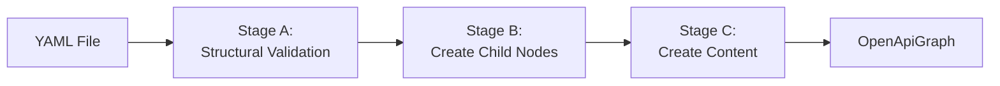

<!-- 67f78c27-eb67-40f0-a691-937607128a98 70574dd2-4aa0-4a7b-9260-5a0e152dd40a -->
# OpenAPI 3.0.0 Analyzer - Complete Implementation

## Architecture Overview

The implementation follows a three-stage pipeline:



### Processing Order

- **Stage A & B**: Top-down (root → leaves) - validate structure and build graph
- **Stage C**: Bottom-up (leaves → root) - create content recursively

### Schema Processing Sub-stages


## Phase 1: Infrastructure & Utilities

### 1.1 Validation Infrastructure

Create [`lib/v3_0_0/validation/validation_context.dart`](lib/v3_0_0/validation/validation_context.dart):

- `ValidationContext` class to collect exceptions during processing
- Methods: `addException()`, `hasErrors()`, `throwIfFailed(strictness)`
- Handles severity-based filtering per strictness level

Create [`lib/v3_0_0/validation/validation_utils.dart`](lib/v3_0_0/validation/validation_utils.dart):

- Port validation utilities from legacy validator
- Methods: `requireField()`, `requireString()`, `requireMap()`, `requireList()`, `requireBool()`, `requireNumber()`
- Field validation: `validateNoUnknownFields()`, `validateEnum()`, `validatePattern()`
- Numeric validation: `validateNonNegative()`, `validatePositive()`, `validateRange()`

### 1.2 Reference Resolution

Create [`lib/v3_0_0/reference/reference_resolver.dart`](lib/v3_0_0/reference/reference_resolver.dart):

- Detect and parse `$ref` strings (internal: `#/components/schemas/User`, external: `common.yaml#/definitions/Base`)
- Resolve internal references within current document
- Load and process external documents recursively
- Cache loaded documents to avoid reprocessing

Update [`lib/v3_0_0/models/openapi_graph.dart`](lib/v3_0_0/models/openapi_graph.dart):

- Add `ValidationContext validationContext` field
- Add `Map<String, dynamic> loadedDocuments` cache for external refs
- Add helper methods for reference resolution

### 1.3 Naming Utilities

Create [`lib/v3_0_0/naming/naming_utils.dart`](lib/v3_0_0/naming/naming_utils.dart):

- `operationNameFromPath(String path, String method)` - converts path + method to PascalCase
- `schemaNameFromContext(SchemaNode node)` - determines schema name from title, component key, operation context, or structural embedding
- Path-to-name conversion helpers (handle `/`, `{}`, `-`, `_`)

## Phase 2: Stage A - Structural Validation

Implement `_validateStructure()` for all node types following the OpenAPI 3.0.0 spec.

### 2.1 Core OpenAPI Nodes

**[`lib/v3_0_0/models/openapi_objects/openapi_document.dart`](lib/v3_0_0/models/openapi_objects/openapi_document.dart)**

- Validate required: `openapi` (string, pattern `^3\.0\.\d+$`), `info` (object), `paths` (object)
- Validate optional: `servers` (array), `components` (object), `security` (array), `tags` (array), `externalDocs` (object)
- Validate no unknown fields

**[`lib/v3_0_0/models/openapi_objects/info.dart`](lib/v3_0_0/models/openapi_objects/info.dart)**

- Validate required: `title` (non-empty string), `version` (non-empty string)
- Validate optional: `description` (string), `termsOfService` (string), `contact` (object), `license` (object)
- Validate no unknown fields

**[`lib/v3_0_0/models/openapi_objects/contact.dart`](lib/v3_0_0/models/openapi_objects/contact.dart)**

- All fields optional: `name`, `url`, `email`
- Validate types and no unknown fields

**[`lib/v3_0_0/models/openapi_objects/license.dart`](lib/v3_0_0/models/openapi_objects/license.dart)**

- Validate required: `name` (non-empty string)
- Validate optional: `url` (string)

### 2.2 Server Objects

**[`lib/v3_0_0/models/openapi_objects/server.dart`](lib/v3_0_0/models/openapi_objects/server.dart)**

- Validate required: `url` (non-empty string)
- Validate optional: `description` (string), `variables` (map of ServerVariable objects)

**[`lib/v3_0_0/models/openapi_objects/server_variable.dart`](lib/v3_0_0/models/openapi_objects/server_variable.dart)**

- Validate required: `default` (string)
- Validate optional: `enum` (array of strings), `description` (string)

### 2.3 Paths and Operations

**[`lib/v3_0_0/models/openapi_objects/paths.dart`](lib/v3_0_0/models/openapi_objects/paths.dart)**

- Validate keys are valid path patterns (start with `/` or are extension fields)
- Validate values are PathItem objects or References

**[`lib/v3_0_0/models/openapi_objects/path_item.dart`](lib/v3_0_0/models/openapi_objects/path_item.dart)**

- Validate optional HTTP method fields: `get`, `put`, `post`, `delete`, `options`, `head`, `patch`, `trace`
- Validate optional: `summary`, `description`, `servers`, `parameters`

**[`lib/v3_0_0/models/openapi_objects/operation.dart`](lib/v3_0_0/models/openapi_objects/operation.dart)**

- Validate required: `responses` (object)
- Validate optional: `tags`, `summary`, `description`, `externalDocs`, `operationId`, `parameters`, `requestBody`, `callbacks`, `deprecated`, `security`, `servers`
- Validate `operationId` is unique if provided (across all operations)

### 2.4 Parameters and Request Bodies

**[`lib/v3_0_0/models/openapi_objects/parameter.dart`](lib/v3_0_0/models/openapi_objects/parameter.dart)**

- Validate required: `name` (string), `in` (enum: query, header, path, cookie)
- If `in` is `path`, validate `required` is true
- Validate optional: `description`, `required`, `deprecated`, `allowEmptyValue`, `schema`, `style`, `explode`, `allowReserved`, `example`, `examples`

**[`lib/v3_0_0/models/openapi_objects/request_body.dart`](lib/v3_0_0/models/openapi_objects/request_body.dart)**

- Validate required: `content` (map of MediaType objects)
- Validate optional: `description`, `required`

**[`lib/v3_0_0/models/openapi_objects/media_type.dart`](lib/v3_0_0/models/openapi_objects/media_type.dart)**

- All fields optional: `schema`, `example`, `examples`, `encoding`
- Validate mutual exclusivity: cannot have both `example` and `examples`

**[`lib/v3_0_0/models/openapi_objects/encoding.dart`](lib/v3_0_0/models/openapi_objects/encoding.dart)**

- Validate optional: `contentType`, `headers`, `style`, `explode`, `allowReserved`

### 2.5 Responses

**[`lib/v3_0_0/models/openapi_objects/response.dart`](lib/v3_0_0/models/openapi_objects/response.dart)**

- Validate required: `description` (string)
- Validate optional: `headers`, `content`, `links`

**Create [`lib/v3_0_0/models/openapi_objects/responses.dart`](lib/v3_0_0/models/openapi_objects/responses.dart)** if not exists

- Validate at least one response is defined
- Validate keys are HTTP status codes (3-digit) or `default`

### 2.6 Components

**[`lib/v3_0_0/models/openapi_objects/components.dart`](lib/v3_0_0/models/openapi_objects/components.dart)**

- All fields optional: `schemas`, `responses`, `parameters`, `examples`, `requestBodies`, `headers`, `securitySchemes`, `links`, `callbacks`
- Validate component keys match pattern: `^[a-zA-Z0-9\.\-_]+$`

### 2.7 Other Objects

**[`lib/v3_0_0/models/openapi_objects/tag.dart`](lib/v3_0_0/models/openapi_objects/tag.dart)**

- Validate required: `name` (non-empty string)
- Validate optional: `description`, `externalDocs`

**[`lib/v3_0_0/models/openapi_objects/external_documentation.dart`](lib/v3_0_0/models/openapi_objects/external_documentation.dart)**

- Validate required: `url` (non-empty string)
- Validate optional: `description`

**[`lib/v3_0_0/models/openapi_objects/security_scheme.dart`](lib/v3_0_0/models/openapi_objects/security_scheme.dart)**

- Validate required: `type` (enum: apiKey, http, oauth2, openIdConnect)
- Validate required fields based on type

**[`lib/v3_0_0/models/openapi_objects/callback.dart`](lib/v3_0_0/models/openapi_objects/callback.dart)**

- Validate runtime expression keys
- Validate values are PathItem objects

**[`lib/v3_0_0/models/openapi_objects/link.dart`](lib/v3_0_0/models/openapi_objects/link.dart)**

- Validate mutually exclusive: `operationRef` or `operationId` (not both)

**[`lib/v3_0_0/models/openapi_objects/header.dart`](lib/v3_0_0/models/openapi_objects/header.dart)**

- Similar to Parameter but without `name` and `in`

**[`lib/v3_0_0/models/openapi_objects/discriminator.dart`](lib/v3_0_0/models/openapi_objects/discriminator.dart)**

- Validate required: `propertyName` (string)
- Validate optional: `mapping` (map of strings)

**[`lib/v3_0_0/models/openapi_objects/xml.dart`](lib/v3_0_0/models/openapi_objects/xml.dart)**

- All fields optional: `name`, `namespace`, `prefix`, `attribute`, `wrapped`

**[`lib/v3_0_0/models/openapi_objects/example.dart`](lib/v3_0_0/models/openapi_objects/example.dart)**

- Validate mutually exclusive: `value` or `externalValue` (not both)

**[`lib/v3_0_0/models/openapi_objects/oauth_flow.dart`](lib/v3_0_0/models/openapi_objects/oauth_flow.dart)** and **[`oauth_flows.dart`](lib/v3_0_0/models/openapi_objects/oauth_flows.dart)**

- Validate required fields based on flow type

**[`lib/v3_0_0/models/openapi_objects/security_requirement.dart`](lib/v3_0_0/models/openapi_objects/security_requirement.dart)**

- Validate structure (map of string to array of strings)

### 2.8 Schema Structural Validation

**[`lib/v3_0_0/models/openapi_objects/schema/schema_node.dart`](lib/v3_0_0/models/openapi_objects/schema/schema_node.dart)**

Validate schema structure:

- Type keyword is valid enum value if present: `string`, `number`, `integer`, `boolean`, `array`, `object`, `null`
- Numeric constraints are numbers: `minimum`, `maximum`, `multipleOf`, `exclusiveMinimum`, `exclusiveMaximum`
- String constraints: `minLength`, `maxLength` are non-negative integers, `pattern` is valid regex
- Array constraints: `minItems`, `maxItems` are non-negative integers, `items` is object or boolean
- Object constraints: `minProperties`, `maxProperties` are non-negative integers, `properties` is object, `required` is array of strings
- Composition keywords are arrays: `allOf`, `oneOf`, `anyOf`
- Validate `$ref` is a string if present
- Validate no unknown JSON Schema keywords

## Phase 3: Stage B - Create Child Nodes

Implement `_createChildNodes()` for all node types to build the graph structure.

### 3.1 OpenApiDocument Child Creation

**[`lib/v3_0_0/models/openapi_objects/openapi_document.dart`](lib/v3_0_0/models/openapi_objects/openapi_document.dart)**

```dart
void _createChildNodes() {
  // Create Info node
  final infoJson = json['info'];
  infoNode = InfoNode(NodeId($id.document, '/info'), infoJson);
  OpenApiGraph.i.addOpenApiNode(infoNode);
  OpenApiGraph.i.addOpenApiEdge(OpenApiEdge($id.absolutePath, infoNode.$id.absolutePath, 'info'));
  
  // Create Paths node
  final pathsJson = json['paths'];
  pathsNode = PathsNode(NodeId($id.document, '/paths'), pathsJson);
  // ... similar for other children
}
```

Create edges for:

- `info` → InfoNode
- `servers` → List<ServerNode>
- `paths` → PathsNode
- `components` → ComponentsNode
- `security` → List<SecurityRequirementNode>
- `tags` → List<TagNode>
- `externalDocs` → ExternalDocumentationNode

### 3.2 Child Node Creation for All Types

Implement child node creation for:

- **InfoNode** → ContactNode, LicenseNode
- **PathsNode** → Map<String, PathItemNode>
- **PathItemNode** → OperationNode for each HTTP method, List<ParameterNode>
- **OperationNode** → List<ParameterNode>, RequestBodyNode, ResponsesNode, Map<String, CallbackNode>
- **RequestBodyNode** → Map<String, MediaTypeNode>
- **MediaTypeNode** → SchemaNode (root edge)
- **ResponseNode** → Map<String, MediaTypeNode>, Map<String, HeaderNode>
- **ParameterNode** → SchemaNode (root edge)
- **HeaderNode** → SchemaNode (root edge)
- **ComponentsNode** → Maps of component nodes (schemas, responses, parameters, etc.)

**Key Pattern**: When creating edges from OpenAPI nodes to SchemaNodes, use `RootEdge` (structural edge type) to mark schema roots in the graph.

### 3.3 Schema Child Node Creation

**[`lib/v3_0_0/models/openapi_objects/schema/schema_node.dart`](lib/v3_0_0/models/openapi_objects/schema/schema_node.dart)**

Implement `_createChildNodes()`:

1. **Handle `$ref`**: If schema has `$ref`, resolve it and create edge (no other children)

   - Internal: `#/components/schemas/User` → resolve within document
   - External: `common.yaml#/definitions/Base` → load external document, resolve
   - Create appropriate edge type based on context

2. **Create Structural Children**:

   - `properties` → Map<String, SchemaNode>, create `PropertiesEdge` for each
   - `items` → SchemaNode, create `ItemsEdge`
   - `additionalProperties` → SchemaNode (if object), create `AdditionalPropertiesEdge`

3. **Create Applicator Children**:

   - `allOf` → List<SchemaNode>, create `AllOfEdge` for each
   - `oneOf` → List<SchemaNode>, create `OneOfEdge` for each
   - `anyOf` → List<SchemaNode>, create `AnyOfEdge` for each

4. **Create XML and ExternalDocs nodes** if present

**Reference Resolution**:

- Check if referenced node already exists in graph
- If not, recursively create it (Stage A + Stage B)
- Merge into unified graph

## Phase 4: Stage C - Create Content (OpenAPI Nodes)

Implement `_createContent()` for all OpenAPI node types.

### 4.1 Pattern

Each OpenAPI object holds reference to its node and accesses child content via getters:

```dart
void _createContent() {
  // Ensure child nodes have created their content first (bottom-up)
  contactNode?._createContent();
  licenseNode?._createContent();
  
  // Create this node's content
  content = Info._(
    $node: this,
    title: json['title'],
    version: json['version'],
    // ... other fields
    extensions: extractExtensions(json),
  );
}
```

### 4.2 Implement for All Types

Implement content creation for all OpenAPI node types:

- OpenApiDocumentNode → OpenApiDocument
- InfoNode → Info
- ContactNode → Contact
- LicenseNode → License
- ServerNode → Server
- ServerVariableNode → ServerVariable
- PathsNode → Paths
- PathItemNode → PathItem
- OperationNode → Operation (include naming logic)
- ParameterNode → Parameter
- RequestBodyNode → RequestBody
- MediaTypeNode → MediaType
- ResponseNode → Response
- ResponsesNode → Responses
- HeaderNode → Header
- ComponentsNode → Components
- TagNode → Tag
- ExternalDocumentationNode → ExternalDocumentation
- SecuritySchemeNode → SecurityScheme
- SecurityRequirementNode → SecurityRequirement
- CallbackNode → Callback
- LinkNode → Link
- DiscriminatorNode → Discriminator
- XMLNode → XML
- ExampleNode → Example
- OAuthFlowNode → OAuthFlow
- OAuthFlowsNode → OAuthFlows

### 4.3 Operation Naming

In **[`lib/v3_0_0/models/openapi_objects/operation.dart`](lib/v3_0_0/models/openapi_objects/operation.dart)**:

```dart
String _determineName() {
  // Use operationId if provided
  if (json.containsKey('operationId')) {
    return toPascalCase(json['operationId']);
  }
  
  // Derive from path and method
  final path = $node.$id.relativePath; // e.g., "/v2/oauth/token"
  final method = // determine from parent PathItemNode
  return operationNameFromPath(path, method); // e.g., "V2OauthTokenPost"
}
```

Store name in Operation object for downstream use.

## Phase 5: Stage C - Create Content (Schema Nodes)

Implement the three sub-stages for SchemaNode content creation.

### 5.1 Stage C.I - Create RawSchema

**[`lib/v3_0_0/models/openapi_objects/schema/schema_node.dart`](lib/v3_0_0/models/openapi_objects/schema/schema_node.dart)**

```dart
void _createRaw() {
  raw = RawSchema.fromJson(json);
  _isRawSet = true;
}
```

The RawSchema class already supports this via its `fromJson` method.

### 5.2 Stage C.II - Create TypedSchema

**Create [`lib/v3_0_0/models/openapi_objects/schema/typed_schema_factory.dart`](lib/v3_0_0/models/openapi_objects/schema/typed_schema_factory.dart)**

Implement type determination and atomic constraint validation:

```dart
TypedSchema createTypedSchema(SchemaNode node, RawSchema raw, ValidationContext ctx) {
  // 1. Determine type
  final schemaType = _determineType(raw, ctx);
  
  // 2. Validate atomic constraints (no composition resolution)
  _validateAtomicConstraints(raw, schemaType, ctx);
  
  // 3. Create appropriate TypedSchema subclass
  switch (schemaType) {
    case SchemaType.integer:
      return _createIntegerTypedSchema(node, raw);
    case SchemaType.number:
      return _createNumberTypedSchema(node, raw);
    case SchemaType.string:
      return _createStringTypedSchema(node, raw);
    case SchemaType.boolean:
      return _createBooleanTypedSchema(node, raw);
    case SchemaType.array:
      return _createArrayTypedSchema(node, raw);
    case SchemaType.object:
      return _createObjectTypedSchema(node, raw);
    default:
      return UnknownTypedSchema(node: node);
  }
}
```

**Type Determination Logic**:

1. If `type` keyword present → use it (validate against type-specific keywords)
2. If no `type` but has type-specific keywords → infer type
3. If `oneOf`/`anyOf` present → may be multi-type (determined later in Effective stage)
4. Otherwise → unknown type

**Atomic Constraint Validation** (add to ValidationContext):

- **Numeric**: `minimum <= maximum`, `multipleOf > 0`
- **String**: `minLength <= maxLength`, `pattern` is valid regex
- **Array**: `minItems <= maxItems`
- **Object**: `minProperties <= maxProperties`, `required` props exist in `properties`
- **Enum**: values compatible with type
- **Default**: value compatible with type and constraints

Update `_createTyped()` in SchemaNode:

```dart
void _createTyped() {
  // Ensure all child schemas have their typed schemas created (bottom-up)
  allOfNodes?.forEach((n) => n._createTyped());
  oneOfNodes?.forEach((n) => n._createTyped());
  anyOfNodes?.forEach((n) => n._createTyped());
  propertiesNodes?.values.forEach((n) => n._createTyped());
  itemsNode?._createTyped();
  additionalPropertiesNode?._createTyped();
  
  typed = TypedSchemaFactory.createTypedSchema(this, raw, OpenApiGraph.i.validationContext);
  isTypedSet = true;
}
```

**Implement TypedSchema subclasses**:

- **[`integer_typed_schema.dart`](lib/v3_0_0/models/openapi_objects/schema/typed_schema/integer_typed_schema.dart)** - Already has structure, populate from raw
- **[`number_typed_schema.dart`](lib/v3_0_0/models/openapi_objects/schema/typed_schema/number_typed_schema.dart)** - Add constraints
- **[`string_typed_schema.dart`](lib/v3_0_0/models/openapi_objects/schema/typed_schema/string_typed_schema.dart)** - Add minLength, maxLength, pattern, format
- **[`boolean_typed_schema.dart`](lib/v3_0_0/models/openapi_objects/schema/typed_schema/boolean_typed_schema.dart)** - Minimal
- **[`array_typed_schema.dart`](lib/v3_0_0/models/openapi_objects/schema/typed_schema/array_typed_schema.dart)** - Add minItems, maxItems, uniqueItems, items reference
- **[`object_typed_schema.dart`](lib/v3_0_0/models/openapi_objects/schema/typed_schema/object_typed_schema.dart)** - Add minProperties, maxProperties, required, properties references

### 5.3 Stage C.III - Create EffectiveSchema

**Create [`lib/v3_0_0/models/openapi_objects/schema/effective_schema_factory.dart`](lib/v3_0_0/models/openapi_objects/schema/effective_schema_factory.dart)**

This is the most complex part - composition resolution and variant analysis.

**Algorithm**:

```dart
EffectiveSchema createEffectiveSchema(SchemaNode node, TypedSchema typed, ValidationContext ctx) {
  // 1. Enumerate branches from applicator graph
  final branches = _enumerateBranches(node);
  
  // 2. Validate each branch
  final validBranches = branches.where((b) => _validateBranch(b, ctx)).toList();
  
  if (validBranches.isEmpty && branches.isNotEmpty) {
    ctx.addException(OpenApiValidationException(
      node.$id.absolutePath,
      'All composition branches are unsatisfiable',
      severity: ValidationSeverity.critical,
    ));
  }
  
  // 3. Determine if multi-type
  final isMultiType = _spansMultipleTypes(validBranches);
  
  // 4. Resolve constraints
  final effectiveConstraints = _mergeConstraints(validBranches, typed);
  
  // 5. Analyze variants
  final variants = _analyzeVariants(node, validBranches);
  
  // 6. Create appropriate EffectiveSchema
  if (isMultiType) {
    return MultiTypeUnionEffectiveSchema(node: node, variants: variants);
  } else {
    return _createSingleTypeEffective(node, typed.type, effectiveConstraints, variants);
  }
}
```

**Branch Enumeration**:

- Traverse applicator edges (AllOfEdge, OneOfEdge, AnyOfEdge)
- `allOf` adds schemas to current branch (intersection)
- `oneOf`/`anyOf` introduces branching (each element is a sub-branch)
- Return list of branches, each branch is a list of SchemaNodes

**Branch Validation**:

- Check type consistency across schemas in branch
- Check constraint compatibility (numeric ranges don't contradict, etc.)
- Validate satisfiability (not empty set)

**Constraint Merging**:

- For numeric: take intersection of ranges (max of minimums, min of maximums)
- For string: take most restrictive lengths
- For array: take most restrictive item counts
- For object: union of required properties, intersection of allowed properties
- For enum: intersection of allowed values

**Variant Analysis**:

1. **Identify variants**:

   - Node-backed: oneOf branches that correspond to existing SchemaNodes
   - Branch-only: Anonymous merged constraints from complex compositions

2. **Discriminator priority**:

   - Primary: oneOf variants (if oneOf exists)
   - Secondary: allOf branches (inheritance case)

3. **Duplicate detection**: Same constraint profile within base type

4. **Subsumption analysis**: One variant's constraints strictly narrower than another

**Implement EffectiveSchema subclasses**:

- **[`integer_effective_schema.dart`](lib/v3_0_0/models/openapi_objects/schema/effective_schema/integer_effective_schema.dart)** - With resolved constraints and variants
- **[`number_effective_schema.dart`](lib/v3_0_0/models/openapi_objects/schema/effective_schema/number_effective_schema.dart)**
- **[`string_effective_schema.dart`](lib/v3_0_0/models/openapi_objects/schema/effective_schema/string_effective_schema.dart)**
- **[`boolean_effective_schema.dart`](lib/v3_0_0/models/openapi_objects/schema/effective_schema/boolean_effective_schema.dart)**
- **[`array_effective_schema.dart`](lib/v3_0_0/models/openapi_objects/schema/effective_schema/array_effective_schema.dart)**
- **[`object_effective_schema.dart`](lib/v3_0_0/models/openapi_objects/schema/effective_schema/object_effective_schema.dart)**

Add variant information to effective schemas:

```dart
class IntegerEffectiveSchema extends SingleTypeEffectiveSchema<int, IntegerEffectiveSchema> {
  // ... existing fields ...
  final List<Variant> variants;
  final List<Variant> duplicateVariants;
  final List<SubsumptionRelation> subsumptions;
}

class Variant {
  final String name;
  final SchemaNode? node; // null for branch-only variants
  final EffectiveSchema schema;
  final bool isNodeBacked;
}
```

Update `_createEffective()` in SchemaNode:

```dart
void _createEffective() {
  // Ensure all child schemas have effective schemas (bottom-up)
  allOfNodes?.forEach((n) => n._createEffective());
  oneOfNodes?.forEach((n) => n._createEffective());
  anyOfNodes?.forEach((n) => n._createEffective());
  propertiesNodes?.values.forEach((n) => n._createEffective());
  itemsNode?._createEffective();
  additionalPropertiesNode?._createEffective();
  
  effective = EffectiveSchemaFactory.createEffectiveSchema(
    this, 
    typed, 
    OpenApiGraph.i.validationContext
  );
  isEffectiveSet = true;
}
```

### 5.4 Schema Naming

**Create [`lib/v3_0_0/models/openapi_objects/schema/schema_naming.dart`](lib/v3_0_0/models/openapi_objects/schema/schema_naming.dart)**

Implement schema naming logic:

```dart
String determineSchemaName(SchemaNode node) {
  // 1. Use title if present
  if (node.raw.title != null) {
    return toPascalCase(node.raw.title!);
  }
  
  // 2. Use component key if in components
  if (node.$id.relativePath.startsWith('/components/schemas/')) {
    return extractComponentKey(node.$id.relativePath);
  }
  
  // 3. Derive from operation context
  final parentOp = _findParentOperation(node);
  if (parentOp != null) {
    if (_isRequestBody(node, parentOp)) {
      return '${parentOp.name}Request';
    }
    if (_isResponse(node, parentOp)) {
      final statusCode = _findStatusCode(node);
      return '${parentOp.name}${statusCode}Response';
    }
  }
  
  // 4. Derive from structural embedding
  final structuralParent = _findStructuralParent(node);
  if (structuralParent != null) {
    final parentName = determineSchemaName(structuralParent);
    final propertyName = _findPropertyName(node, structuralParent);
    return '$parentName${toPascalCase(propertyName)}';
  }
  
  // 5. Fallback
  return 'Schema${node.$id.absolutePath.hashCode}';
}
```

Add `name` field to SchemaNode and populate in `_createEffective()`.

## Phase 6: Entry Point and Orchestration

### 6.1 Update OpenApiGraph

**[`lib/v3_0_0/models/openapi_graph.dart`](lib/v3_0_0/models/openapi_graph.dart)**

Update `create()` method:

```dart
OpenApiDocument create({ValidationStrictness strictness = ValidationStrictness.moderate}) {
  // Initialize validation context
  validationContext = ValidationContext();
  
  try {
    // Load and parse YAML
    if (!file.existsSync()) {
      throw Exception('File not found: ${file.path}');
    }
    
    final yamlContent = file.readAsStringSync();
    final yamlDoc = loadYaml(yamlContent);
    
    // Create root node (triggers three-stage pipeline)
    final rootId = NodeId(file.uri.pathSegments.last, '/');
    final rootNode = OpenApiDocumentNode(rootId, yamlDoc);
    root = rootNode.content;
    
    // Check for validation failures
    validationContext.throwIfFailed(strictness);
    
    return root;
  } catch (e) {
    print('Error creating OpenAPI graph: $e');
    rethrow;
  }
}
```

### 6.2 Main Validator Entry Point

**[`lib/v3_0_0/openapi_validator_v3_0_0.dart`](lib/v3_0_0/openapi_validator_v3_0_0.dart)**

```dart
class OpenApiValidatorV3_0_0 {
  static OpenApiGraph validate(
    File file, {
    ValidationStrictness strictness = ValidationStrictness.moderate,
  }) {
    final graph = OpenApiGraph(file);
    graph.create(strictness: strictness);
    return graph;
  }
}
```

## Phase 7: Testing and Validation

### 7.1 Create Test OpenAPI Specs

Create test YAML files in `bin/` or `test/` with various complexity levels:

- Simple spec with basic operations
- Spec with schema compositions (allOf, oneOf, anyOf)
- Spec with external references
- Spec with circular references
- Spec with validation errors at different severity levels

### 7.2 Manual Testing

Create test harness:

```dart
void main() {
  final file = File('bin/petstore.yaml');
  final graph = OpenApiValidatorV3_0_0.validate(
    file,
    strictness: ValidationStrictness.strict,
  );
  
  print('Validation successful!');
  print('Operations: ${graph.root.paths.operations.length}');
  print('Schemas: ${graph.schemaNodes.length}');
}
```

## Implementation Notes

### Key Files to Create

- `lib/v3_0_0/validation/validation_context.dart`
- `lib/v3_0_0/validation/validation_utils.dart`
- `lib/v3_0_0/reference/reference_resolver.dart`
- `lib/v3_0_0/naming/naming_utils.dart`
- `lib/v3_0_0/models/openapi_objects/schema/typed_schema_factory.dart`
- `lib/v3_0_0/models/openapi_objects/schema/effective_schema_factory.dart`
- `lib/v3_0_0/models/openapi_objects/schema/schema_naming.dart`

### Files to Modify

- All node files in `lib/v3_0_0/models/openapi_objects/` (~25 files)
- `lib/v3_0_0/models/openapi_objects/schema/schema_node.dart`
- `lib/v3_0_0/models/openapi_graph.dart`
- `lib/v3_0_0/openapi_validator_v3_0_0.dart`
- All TypedSchema subclass files (add constraint fields)
- All EffectiveSchema subclass files (add resolved constraints, variants)

### Validation Patterns

**Critical Severity** (always fail):

- Missing required fields
- Type mismatches
- Unsatisfiable constraints (empty set)
- Invalid references
- Duplicate operationIds

**Moderate Severity** (fail in moderate/strict):

- Schemas allowing only trivial instances
- Ambiguous compositions

**Low Severity** (fail only in strict):

- Missing type declarations
- Type-property mismatches (e.g., string schema with `minItems`)

### Execution Order

The implementation should follow this order to maintain dependencies:

1. Phase 1 (Infrastructure) - provides utilities for other phases
2. Phase 2 (Stage A) - validates before building graph
3. Phase 3 (Stage B) - builds graph structure
4. Phase 4 (Stage C OpenAPI) - creates OpenAPI objects
5. Phase 5 (Stage C Schema) - creates schema semantics
6. Phase 6 (Entry Point) - orchestrates everything
7. Phase 7 (Testing) - validates implementation

### To-dos

- [ ] Create validation and utility infrastructure (ValidationContext, ValidationUtils, ReferenceResolver, NamingUtils)
- [ ] Implement structural validation for all OpenAPI node types
- [ ] Implement structural validation for SchemaNode
- [ ] Implement child node creation and edge construction for OpenAPI nodes
- [ ] Implement child node creation for SchemaNode with reference resolution
- [ ] Implement content creation for all OpenAPI node types with naming logic
- [ ] Implement RawSchema creation (Stage C.I for SchemaNode)
- [ ] Implement TypedSchema creation with type determination and atomic constraint validation (Stage C.II)
- [ ] Implement EffectiveSchema creation with composition resolution and variant analysis (Stage C.III)
- [ ] Update OpenApiGraph and create entry point with validation strictness handling
- [ ] Create test specs and validate implementation